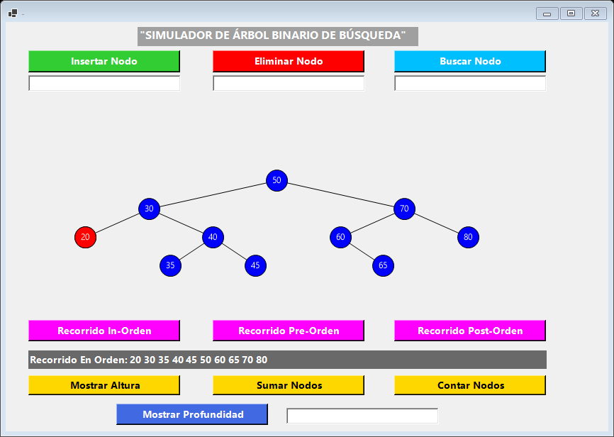
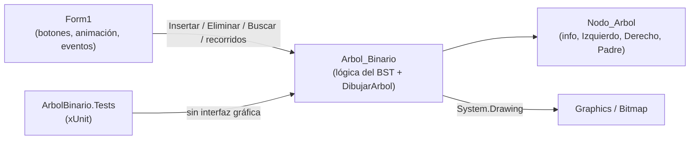

<div align="center">
  
  <h1>ArbolVisual</h1>
  <p><b>Simulador de escritorio para ver, paso a paso, cómo funciona un árbol binario de búsqueda.</b></p>
  
  
  
  
  
  <br />
  
  <p>
    <a href="#-inicio-rápido">Inicio rápido</a> ·
    <a href="#-características">Características</a> ·
    <a href="#-arquitectura">Arquitectura</a> ·
    <a href="#-pruebas">Pruebas</a> ·
    <a href="#-lo-que-todavía-no-existe">Limitaciones</a>
  </p>
</div>

ArbolVisual es una aplicación **Windows Forms** pensada para aprender estructuras de datos: insertas, eliminas y buscas enteros (1 a 99) y el dibujo del árbol se recalcula en cada operación. **No** es una librería reutilizable ni una herramienta para árboles balanceados (AVL, rojo-negro): es un BST simple con fines didácticos.

## 🎬 Vista rápida

Captura real de la aplicación con un árbol de 10 nodos tras usar *Recorrido In-Orden* (el nodo 20 aparece en rojo porque la captura se tomó durante la animación del recorrido):

<div align="center">
  
</div>

## ✨ Características

| Característica | Detalle |
|---|---|
| Insertar / eliminar / buscar | Enteros de 1 a 99, manteniendo la propiedad de orden del BST |
| Eliminación con dos hijos | Se promueve el predecesor in-order (mayor del subárbol izquierdo); cubierto por pruebas que verifican que el árbol siga siendo un BST válido |
| Recorridos | En-orden, pre-orden y post-orden, mostrados como texto y animados resaltando cada nodo en rojo |
| Estadísticas | Altura, suma de valores, cantidad de nodos y profundidad de un valor |
| Casos límite | Duplicados, valores inexistentes y árbol vacío no corrompen el árbol ni bloquean la app |
| Dibujo | `Arbol_Binario.DibujarArbol` recalcula la posición de todos los nodos desde la raíz en cada operación (GDI+) |

## 🏗️ Arquitectura



<details>
<summary>Estructura de carpetas</summary>

```
ArbolBinario/           App WinForms (net8.0-windows)
  Program.cs            Punto de entrada
  Form1.cs              Ventana principal, eventos y animación de recorridos
  Arbol_Binario.cs      Lógica del BST y dibujo
  Nodo_Arbol.cs         Nodo del árbol
ArbolBinario.Tests/     Pruebas xUnit del BST
ArbolBinario.sln
.github/workflows/build-and-test.yml
```

</details>

## 🚀 Inicio rápido

| Requisito | Versión |
|---|---|
| Windows | Necesario (Windows Forms) |
| SDK de .NET | 8 (`net8.0-windows`) |

```bash
git clone https://github.com/Luiss2080/ArbolVisual.git
cd ArbolVisual
dotnet build ArbolBinario.sln
dotnet run --project ArbolBinario/ArbolBinario.csproj
```

1. Escribe un valor entre 1 y 99 en el cuadro de **Insertar Nodo**, o en los de **Eliminar** / **Buscar**.
2. Usa **Recorrido In-Orden / Pre-Orden / Post-Orden** para ver el recorrido animado.
3. Usa **Mostrar Altura**, **Sumar Nodos**, **Contar Nodos** y **Mostrar Profundidad** para las estadísticas.

## 🧪 Pruebas

24 pruebas xUnit sobre `Arbol_Binario`/`Nodo_Arbol`, sin depender de la interfaz: inserción, eliminación (incluido el caso de dos hijos en varias formas de árbol), búsqueda, recorridos en árboles balanceados y degenerados, y casos límite. Las 24 pasan al escribir este README.

```bash
dotnet test ArbolBinario.Tests/ArbolBinario.Tests.csproj
```

La interfaz gráfica no tiene pruebas automáticas. CI: `.github/workflows/build-and-test.yml` compila la solución y ejecuta las pruebas en `windows-latest`.

## 🚧 Lo que todavía no existe

- **Buscar** informa las coordenadas del nodo en un cuadro de diálogo, pero **no lo resalta** sobre el dibujo (función incompleta heredada del código original).
- Solo enteros de 1 a 99; sin balanceo automático (con datos ordenados el árbol degenera en lista).
- Solo Windows; sin pruebas de la interfaz.
- Corregido: **Eliminar** sobre un árbol vacío antes insertaba el valor por un error de copiar-y-pegar; ahora no hace nada.

## 📄 Licencia

MIT. Ver [`LICENSE`](LICENSE).

<div align="center"><sub>Hecho por Luiss2080 · C# · Windows Forms</sub></div>
